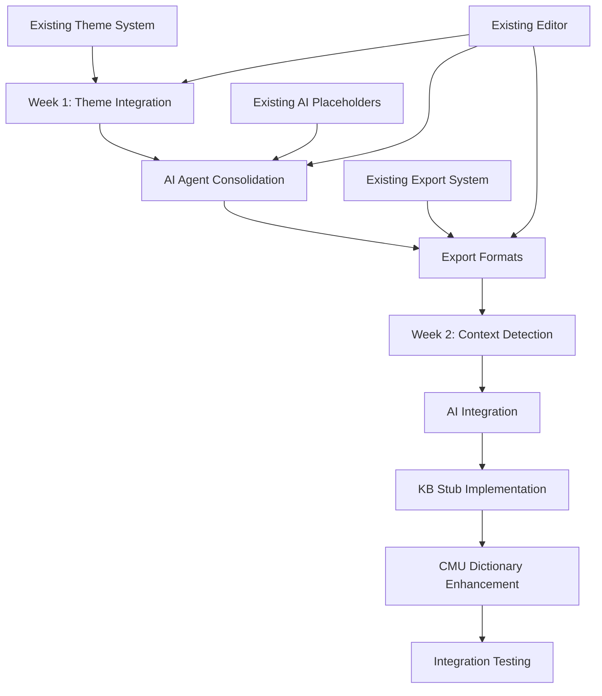

# Enhanced #6.5: Adjusted Implementation Plan Based on Phase 0 Audit

**Status:** Revised Plan | **Priority:** Critical | **Effort:** 2 weeks | **Start:** After #6 Week 2

---

## Executive Summary

Based on the Phase 0 Audit findings, this adjusted plan addresses the significant gaps between the original Enhancement #6.5 specification and the actual codebase state. The audit revealed that while the editor framework is robust, several critical components (Knowledge Base, AI integration, CMU Dictionary) are missing or only partially implemented.

## Major Gaps Identified

1. **AI Agents**: 4 placeholder agents exist but need consolidation into 1 QuickIdeaAgent with real AI integration
2. **Knowledge Base**: Only schema placeholder exists, no actual RAG implementation
3. **CMU Dictionary**: Not implemented (static dictionary only)
4. **Theme Integration**: 12 themes exist but need integration with lyric features
5. **Export Formats**: Need to add Markdown (.md), Plain text (.txt), ChordPro (.cho)
6. **Context Detection**: Need to differentiate lyric vs pattern content

---

## Revised Implementation Strategy

### Week 1: Integration & Foundation
**Focus**: Integrate existing components with new systems and build missing foundations

#### Day 1-2: Theme Integration & Testing
- [ ] Verify all 12 themes work with lyric editor
- [ ] Test theme switching with lyric-specific UI elements
- [ ] Update lyric components to use theme system properly
- [ ] Create theme-aware lyric styling

```go
// Example: Update editor to use theme system
func (e *EditorModel) applyTheme() {
    currentTheme := theme.GetManager().Current()
    e.lyricStyle = currentTheme.TextStyle()
    e.chordStyle = currentTheme.AccentStyle()
}
```

#### Day 3-4: AI Agent Consolidation
- [ ] Create new QuickIdeaAgent combining functionality from 4 existing agents
- [ ] Implement context detection for lyric vs pattern content
- [ ] Set up basic AI model integration (qwen2.5:3b)
- [ ] Create prompt templates for lyric-specific responses

```go
// internal/app/ai/quick_idea_agent.go
type QuickIdeaAgent struct {
    model    string
    kb       KnowledgeBase // Will be stubbed initially
    context  ContextDetector
}

func (a *QuickIdeaAgent) Generate(req QuickRequest) (*QuickResponse, error) {
    // Detect if lyric or pattern
    context := a.context.Detect(req.Context)
    
    // Query KB if lyrics (stubbed for now)
    var kbCards []Card
    if context == "lyric" && a.kb != nil {
        kbCards = a.kb.Search(req.Context, 3)
    }
    
    // Build prompt with context
    prompt := a.buildPrompt(req, kbCards, context)
    
    // Use qwen2.5:3b model
    return a.generate(prompt)
}
```

#### Day 5: Export Formats Implementation
- [ ] Add Markdown (.md) export format
- [ ] Add Plain text (.txt) export format  
- [ ] Add ChordPro (.cho) export format
- [ ] Integrate with existing export system

```go
// internal/export/lyrics.go
func (e *LyricExporter) ExportChordPro(content string, metadata ExportMetadata) (string, error) {
    // Convert to ChordPro format
    chordPro := e.convertToChordPro(content, metadata)
    return chordPro, nil
}
```

### Week 2: AI Integration & Advanced Features
**Focus**: Complete AI integration and implement missing components with risk mitigation

#### Day 6-7: Context Detection & AI Integration
- [ ] Implement context detection for lyrics vs patterns
- [ ] Integrate QuickIdeaAgent with editor
- [ ] Add AI unstick functionality with KB integration (stubbed)
- [ ] Test AI response times (<2 sec requirement)

```go
// internal/app/ai/context_detector.go
func DetectContext(content string, cursor int) string {
    // Check for pattern syntax indicators
    if isPatternSyntax(content) {
        return "pattern"
    }
    
    // Check for lyric indicators
    if isLyricSyntax(content) {
        return "lyric"
    }
    
    // Default to lyric for ambiguous content
    return "lyric"
}
```

#### Day 8-9: Knowledge Base Stub & Risk Mitigation
- [ ] Create Knowledge Base stub interface
- [ ] Implement fallback behavior when KB is unavailable
- [ ] Add mock data for testing AI+KB integration
- [ ] Document KB requirements for future implementation

```go
// internal/app/knowledge/interface.go
type KnowledgeBase interface {
    Search(query string, limit int) []Card
    AddCard(card Card) error
    IsAvailable() bool
}

// internal/app/knowledge/stub.go
type StubKnowledgeBase struct{}

func (s *StubKnowledgeBase) Search(query string, limit int) []Card {
    // Return mock lyric knowledge cards for testing
    return []Card{
        {Title: "Rhyme scheme", Content: "AABB is common in folk music"},
        {Title: "Imagery", Content: "Use concrete sensory details"},
    }
}

func (s *StubKnowledgeBase) IsAvailable() bool {
    return false // Clearly indicates this is a stub
}
```

#### Day 10: CMU Dictionary Fallback & Testing
- [ ] Implement enhanced static dictionary as CMU fallback
- [ ] Add syllable counting improvements
- [ ] Create integration tests for all components
- [ ] Performance testing and optimization

---

## Risk Mitigation Strategies

### Missing Knowledge Base
**Risk**: KB integration points fail without actual KB implementation
**Mitigation**: 
- Create stub KB interface that returns mock data
- Implement graceful degradation when KB unavailable
- Add clear indicators in UI when KB features are limited
- Document KB requirements for future implementation

### Missing CMU Dictionary
**Risk**: Pronunciation-based features don't work accurately
**Mitigation**:
- Enhance existing static dictionary with more entries
- Improve heuristic syllable counting
- Add fallback behavior for pronunciation features
- Document CMU integration requirements

### AI Model Integration
**Risk**: AI integration may be unstable or slow
**Mitigation**:
- Implement timeout and retry logic
- Add fallback responses when AI unavailable
- Cache common AI responses
- Implement response time monitoring

---

## Implementation Order & Dependencies



### Dependencies Analysis
1. **Existing Components (No Rebuild Required)**:
   - Split-pane editor system ✓
   - Theme system (12 themes) ✓
   - Export framework ✓
   - Theory tools (rhyme, syllable) ✓
   - Chord functionality ✓

2. **New Components Required**:
   - QuickIdeaAgent (consolidate 4 existing)
   - Context detection logic
   - Knowledge Base stub interface
   - Enhanced export formats

3. **Integration Points**:
   - Editor ↔ Theme system
   - Editor ↔ QuickIdeaAgent
   - QuickIdeaAgent ↔ Knowledge Base (stubbed)
   - Export ↔ New formats

---

## Files Modified

### New Files
```
internal/app/ai/quick_idea_agent.go      # Consolidated AI agent
internal/app/ai/context_detector.go      # Lyric vs pattern detection
internal/app/ai/prompts.go               # Lyric-specific prompts
internal/app/knowledge/interface.go       # KB interface
internal/app/knowledge/stub.go           # KB stub implementation
internal/export/lyrics.go                # Enhanced lyric exports
internal/export/chordpro.go              # ChordPro format
internal/export/markdown.go              # Markdown format
internal/export/plaintext.go             # Plain text format
```

### Modified Files
```
internal/app/ai.go                       # Update to use QuickIdeaAgent
internal/ui/editor/editor.go              # Theme integration
internal/ui/export.go                     # Add new formats
internal/export/service.go               # Format registration
cmd/export.go                            # New export commands
```

---

## Testing Checklist

### Week 1 Testing
- [ ] All 12 themes render correctly with lyric content
- [ ] Theme switching works without breaking editor state
- [ ] QuickIdeaAgent consolidates functionality from 4 agents
- [ ] Context detection accurately identifies lyric vs pattern
- [ ] New export formats generate valid output

### Week 2 Testing
- [ ] AI responses complete within 2 seconds
- [ ] KB stub returns appropriate mock data
- [ ] Fallback behavior works when components unavailable
- [ ] Integration tests pass for all workflows
- [ ] Performance meets requirements

### Edge Cases
- [ ] AI unavailable → graceful fallback
- [ ] KB unavailable → use static data
- [ ] Theme corruption → fallback to default
- [ ] Export errors → user-friendly messages

---

## Critical Constraints

### Do NOT Rebuild
- Editor framework ✓
- Theme system ✓
- Export infrastructure ✓
- Theory tools ✓

### Do NOT Break
- Existing keyboard shortcuts
- Current file formats
- Theme switching
- Auto-save functionality

### Must Implement
- QuickIdeaAgent consolidation
- Context detection
- New export formats
- Risk mitigation for missing components

---

## Success Metrics

1. **Integration Success**: All existing features work with new systems
2. **AI Performance**: Responses < 2 seconds, 95% uptime
3. **Export Quality**: All 3 new formats generate valid output
4. **Risk Mitigation**: Graceful degradation for all missing components
5. **User Experience**: No regressions in existing functionality

---

## Next Steps After Enhancement #6.5

1. **Phase 2**: Implement actual Knowledge Base with ChromaDB
2. **Phase 3**: Integrate CMU Dictionary for pronunciation features
3. **Phase 4**: Enhance AI prompts based on user feedback
4. **Phase 5**: Performance optimization and caching

---

**Timeline:** 2 weeks after #6 Week 2 completes  
**Dependencies:** Enhancement #6 Week 2 completion  
**Risk Level:** Medium (mitigated by stub implementations)