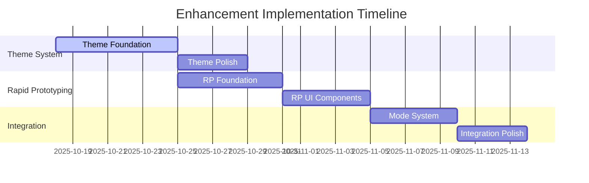

# Enhancement Integration Roadmap
## Enhancement 2 (Rapid Prototyping) & Theme System Integration

**Version:** 1.0  
**Date:** October 18, 2025  
**Purpose:** Comprehensive implementation plan for integrating Enhancement 2 (Rapid Prototyping) and Theme System into noise.sh

---

## Executive Summary

Based on analysis of the current codebase and enhancement specifications, this roadmap outlines the optimal sequence for implementing both enhancements. The recommended approach prioritizes the Theme System first, as it provides foundational infrastructure that will benefit the Rapid Prototyping features and the entire application.

### Current Project Status
- **Phase:** Post-Phase 2 completion (Editor & UI foundation in place)
- **Architecture:** Modular monolith with clear separation of concerns
- **UI Framework:** Bubble Tea with Lipgloss styling
- **Current Theme:** Single "Midnight Jazz" theme hardcoded
- **AI Integration:** Placeholder implementation ready for enhancement

---

## Implementation Sequence Recommendation

### Recommended Order: **Theme System → Rapid Prototyping**

**Rationale:**
1. Theme System provides foundational infrastructure for the entire UI
2. Rapid Prototyping will benefit from theme-aware UI components
3. Theme System has fewer dependencies and can be implemented independently
4. Rapid Prototyping requires AI integration that builds on existing services

---

## Phase-by-Phase Implementation Plan

### Phase 1: Theme System Foundation (Week 1)
**Priority:** Critical Infrastructure  
**Effort:** 5-7 days

#### 1.1 Create Theme Package Structure
```bash
internal/
├── theme/
│   ├── theme.go          # Theme struct and core methods
│   ├── manager.go        # Theme switching logic with thread safety
│   ├── registry.go       # All 12 themes registered
│   └── loader.go         # Custom theme loading from config
```

#### 1.2 Implement Core Theme Infrastructure
- Create [`Theme`](internal/theme/theme.go:1) struct with 6 color properties
- Implement thread-safe [`Manager`](internal/theme/manager.go:1) with singleton pattern
- Register all 12 themes from specification in [`Registry`](internal/theme/registry.go:1)
- Add theme validation and fallback mechanisms

#### 1.3 Integrate with Configuration System
- Extend [`Config`](internal/config/config.go:13) struct to include theme preference
- Add theme persistence to [`~/.config/noise/config.json`](internal/config/config.go:225)
- Implement custom theme loading from config file
- Add theme validation for user-defined themes

#### 1.4 Update UI Components for Theme Awareness
- Refactor [`styles/theme.go`](internal/ui/styles/theme.go:1) to use dynamic theme system
- Update all UI components to use theme manager instead of hardcoded colors
- Implement theme switching hotkey (Ctrl+T) in editor
- Add theme indicator to status bar

**Acceptance Criteria:**
- All 12 themes implemented and selectable
- Theme preference persists across sessions
- Runtime theme switching works without restart
- All UI components use theme colors consistently

---

### Phase 2: Theme System Polish (Week 2)
**Priority:** High  
**Effort:** 3-4 days

#### 2.1 Theme Preview and Selection UI
- Create theme preview modal showing sample text in each theme
- Implement theme selector with visual previews
- Add theme cycling with Ctrl+T keybinding
- Show current theme name in status bar

#### 2.2 Custom Theme Support
- Implement custom theme validation in config
- Create theme template generator command
- Add documentation for custom theme creation
- Test custom theme loading and switching

#### 2.3 Accessibility and Performance
- Verify WCAG AA compliance for all themes
- Optimize theme switching performance (<50ms)
- Add high-contrast mode option
- Test color contrast ratios programmatically

**Acceptance Criteria:**
- Theme preview modal works for all 12 themes
- Custom themes load and validate correctly
- All themes pass accessibility requirements
- Theme switching is instant and smooth

---

### Phase 3: Rapid Prototyping Foundation (Week 3)
**Priority:** High  
**Effort:** 5-6 days

#### 3.1 CLI Command Infrastructure
- Implement Cobra CLI framework in [`cmd/noise/main.go`](cmd/noise/main.go:104)
- Add `quick` command: `noise quick [theme]`
- Implement argument parsing for theme parameter
- Add help system for new commands

#### 3.2 Scratch Mode Implementation
- Extend [`EditorModel`](internal/ui/editor.go:15) with scratch mode flag
- Implement unsaved draft state management
- Add "SCRATCH" indicator to status bar
- Implement Ctrl+K "Keep Draft" functionality
- Add discard confirmation on quit

#### 3.3 Enhanced AI Service Integration
- Extend [`AIService`](internal/app/ai.go:12) with rapid prototyping methods
- Implement [`RapidBrainstormAgent`](internal/app/ai/brainstorm.go:1) for 3-angle suggestions
- Create [`ContinuationAgent`](internal/app/ai/continuation.go:1) for line generation
- Add [`VariationAgent`](internal/app/ai/variation.go:1) for line alternatives

**Acceptance Criteria:**
- `noise quick` command launches directly into editor
- Scratch mode works without auto-save
- AI agents generate contextually appropriate suggestions
- All rapid prototyping AI methods functional

---

### Phase 4: Rapid Prototyping UI Components (Week 4)
**Priority:** High  
**Effort:** 4-5 days

#### 4.1 Streamlined Brainstorm Flow
- Create inline brainstorm UI in editor pane
- Implement 3-angle selection with number keys (1-3)
- Add automatic first line generation
- Integrate with existing [`SplitPaneModel`](internal/ui/editor/split_pane.go:1)

#### 4.2 Continue Writing Feature (Ctrl+G)
- Implement continuation suggestion overlay
- Add 3-variation display with number selection
- Integrate with editor cursor position
- Handle Esc key to cancel suggestions

#### 4.3 Line Variation Generator (Ctrl+V)
- Add text selection support to editor
- Implement variation modal with side-by-side comparison
- Add constraint options (more concrete, different POV)
- Integrate with editor text replacement

**Acceptance Criteria:**
- Brainstorm flow completes in <15 seconds
- Continue writing responds in <2 seconds
- Line variations generate with 3 alternatives
- All hotkeys work without leaving keyboard

---

### Phase 5: Mode System and Quality Checks (Week 5)
**Priority:** Medium  
**Effort:** 4-5 days

#### 5.1 Three-Mode System Implementation
- Implement Sketch/Draft/Polish modes in [`EditorModel`](internal/ui/editor.go:15)
- Create mode-specific layouts for each mode
- Add Ctrl+1/2/3 keybindings for mode switching
- Implement mode-specific AI temperature settings

#### 5.2 Tiered Quality System
- Extend quality checking in [`AIService`](internal/app/ai.go:67) for 3-tier system
- Implement red flags check for Sketch mode
- Add basic quality check for Draft mode
- Keep full critique for Polish mode

#### 5.3 Mode-Specific UI Adaptations
- Adjust editor width based on mode
- Show/hide theory tools based on mode
- Implement mode indicator in status bar
- Add mode-specific help text

**Acceptance Criteria:**
- Mode switching works instantly with Ctrl+1/2/3
- Each mode shows appropriate UI elements
- Quality checks scale with mode complexity
- AI temperature adjusts per mode

---

### Phase 6: Integration and Polish (Week 6)
**Priority:** Medium  
**Effort:** 3-4 days

#### 6.1 Cross-Feature Integration
- Ensure rapid prototyping features work with all themes
- Test theme switching during rapid prototyping workflows
- Verify scratch mode works with theme persistence
- Test mode switching with different themes

#### 6.2 Performance Optimization
- Optimize AI response times for rapid prototyping
- Implement caching for frequently used suggestions
- Add lazy loading for theme resources
- Profile memory usage during extended sessions

#### 6.3 Documentation and Help
- Update help system to include new features
- Add theme documentation to help pane
- Create quick start guide for rapid prototyping
- Update keyboard shortcuts reference

**Acceptance Criteria:**
- All features work seamlessly together
- Performance meets specifications (<2s AI response)
- Documentation is comprehensive and accurate
- Help system covers all new functionality

---

## Dependencies Analysis

### Theme System Dependencies
- **Low dependency** - Can be implemented independently
- **Required by:** Rapid Prototyping (for themed UI components)
- **Integration points:** All UI components, configuration system

### Rapid Prototyping Dependencies
- **Medium dependency** - Requires AI service enhancements
- **Depends on:** Theme System (for consistent UI)
- **Integration points:** Editor, AI services, CLI commands

### Shared Dependencies
- [`Config`](internal/config/config.go:13) system for persistence
- [`EditorModel`](internal/ui/editor.go:15) for UI integration
- [`AIService`](internal/app/ai.go:12) for AI functionality
- [`SplitPaneModel`](internal/ui/editor/split_pane.go:1) for layout

---

## Risk Assessment and Mitigation Strategies

### High-Risk Areas

#### 1. AI Integration Complexity
**Risk:** Rapid prototyping requires sophisticated AI integration
**Mitigation:**
- Implement AI agents incrementally
- Start with mock responses, integrate real Ollama later
- Add comprehensive error handling for AI failures
- Implement fallback behavior when AI is unavailable

#### 2. Theme System Performance
**Risk:** Theme switching could cause UI lag
**Mitigation:**
- Implement theme preloading and caching
- Use efficient color lookup mechanisms
- Test with low-performance terminals
- Add performance monitoring for theme operations

#### 3. CLI Command Integration
**Risk:** Adding Cobra CLI could break existing argument parsing
**Mitigation:**
- Implement Cobra alongside existing parser initially
- Maintain backward compatibility during transition
- Add comprehensive tests for all command variations
- Create migration plan for existing users

### Medium-Risk Areas

#### 1. User Experience Consistency
**Risk:** New features might feel disconnected from existing UI
**Mitigation:**
- Use existing design patterns for new components
- Maintain consistent keyboard shortcuts
- Test with existing users for feedback
- Ensure seamless integration with current workflows

#### 2. Configuration Complexity
**Risk:** Multiple new configuration options could confuse users
**Mitigation:**
- Provide sensible defaults for all new options
- Add in-app explanations for new settings
- Create migration path for existing configurations
- Document all new configuration options

---

## Testing Strategy

### Theme System Testing
```go
// Test theme switching
func TestThemeSwitching(t *testing.T) {
    manager := theme.NewManager()
    manager.SetTheme("slate")
    assert.Equal(t, "slate", manager.Current().Name)
    
    manager.SetTheme("invalid-theme")
    assert.Equal(t, "amber-night", manager.Current().Name) // fallback
}

// Test theme persistence
func TestThemePersistence(t *testing.T) {
    cfg := &config.Config{Theme: "molten-gold"}
    err := cfg.Save()
    assert.NoError(t, err)
    
    loaded, err := config.Load()
    assert.NoError(t, err)
    assert.Equal(t, "molten-gold", loaded.UI.Theme)
}
```

### Rapid Prototyping Testing
```go
// Test quick command
func TestQuickCommand(t *testing.T) {
    // Test CLI argument parsing
    cmd := rootCmd.Command("quick")
    assert.NotNil(t, cmd)
    
    // Test with theme argument
    args := []string{"quick", "heartbreak"}
    err := cmd.ParseFlags(args)
    assert.NoError(t, err)
}

// Test scratch mode
func TestScratchMode(t *testing.T) {
    model := editor.NewEditorModel(nil)
    model.SetScratchMode(true)
    
    assert.True(t, model.IsScratch())
    assert.False(t, model.IsSaved())
    
    // Test discard on quit
    msg := model.HandleQuit()
    assert.IsType(t, ConfirmationMsg{}, msg)
}
```

### Integration Testing
```bash
# Test theme switching with rapid prototyping
noise quick "test theme"
# Switch themes with Ctrl+T
# Verify all UI elements update correctly

# Test scratch mode with different themes
noise quick
# Write content, switch themes
# Verify scratch indicator persists

# Test mode switching with themes
noise quick "test"
# Switch between Sketch/Draft/Polish modes
# Verify UI adapts correctly
```

---

## Success Metrics

### Quantitative Metrics
- **Theme switching time:** <50ms for all themes
- **Quick start to first word:** <30 seconds
- **AI response time:** <2 seconds for continuations
- **Theme adoption:** >80% of users try multiple themes
- **Rapid prototyping usage:** >60% of users use quick command

### Qualitative Metrics
- Users report "feels fast" for rapid prototyping
- No complaints about theme switching friction
- Positive feedback on scratch mode freedom
- Users complete more drafts with rapid prototyping

---

## Rollout Plan

### Alpha Testing (Week 1-2)
- Internal testing of theme system
- Verify all 12 themes render correctly
- Test theme switching performance
- Validate custom theme loading

### Beta Testing (Week 3-4)
- Limited release to 5-10 trusted users
- Focus on rapid prototyping workflows
- Collect feedback on AI suggestion quality
- Test integration between features

### Public Release (Week 5-6)
- Full release with both enhancements
- Update documentation and tutorials
- Create demo videos showcasing new features
- Monitor performance and user feedback

---

## Implementation Timeline



---

## Conclusion

This roadmap provides a comprehensive plan for integrating both Enhancement 2 (Rapid Prototyping) and the Theme System into noise.sh. The recommended sequence prioritizes the Theme System first, as it provides foundational infrastructure that will benefit the entire application, including the Rapid Prototyping features.

The implementation is designed to be incremental, with each phase building on the previous one while maintaining system stability and user experience. The 6-week timeline allows for thorough testing and refinement while delivering value to users incrementally.

By following this roadmap, noise.sh will gain a professional theme system and powerful rapid prototyping capabilities that will significantly enhance the songwriting experience for users.